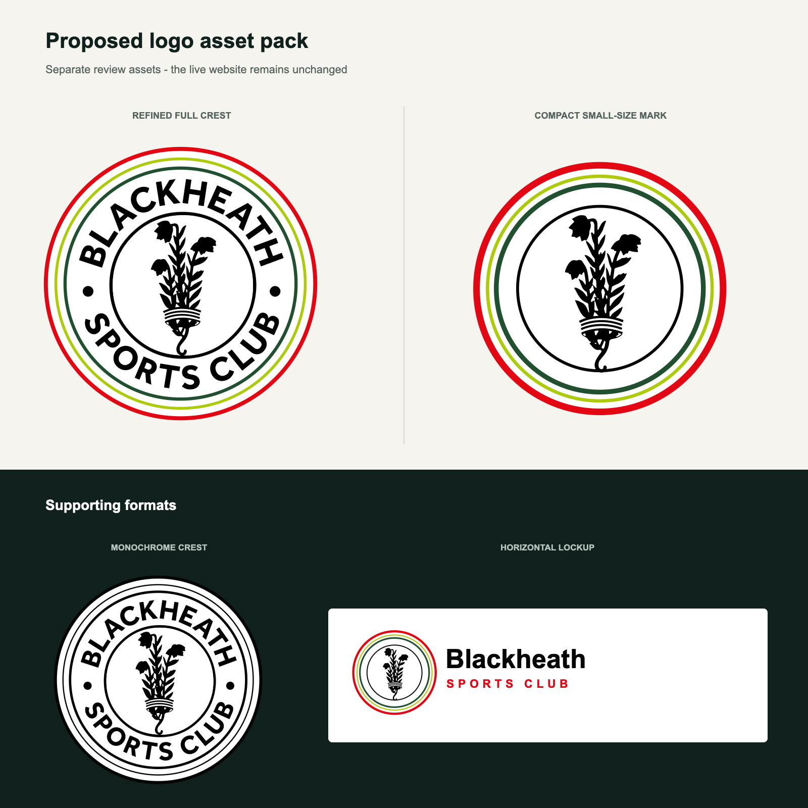

# Logo Refinement Study

## Status

**Proposal only.** The existing approved crest remains in production. None of
the proposed files are imported by the website.

## Objective

Create a more flexible logo system without discarding the club's recognisable
heritage. The proposed assets preserve the circular structure, the original
heather drawing, the club name and the red, lime and green palette.

## Proposed System

| Asset | Intended use |
| --- | --- |
| Refined crest | Signage, clubhouse material, larger website placements |
| Compact mark | Navigation, favicon, social avatar and small applications |
| Monochrome crest | Embroidery, stamps and restricted printing |
| Horizontal lockup | Narrow headers, sponsorship and partner placements |

## Review Before Adoption

1. Confirm that the committee is comfortable with the adjusted ring weights and
   enlarged heather.
2. Test the compact mark at 16, 32, 48 and 64 pixels.
3. Produce print and embroidery proofs.
4. Confirm minimum size and clear-space rules.
5. Approve the complete pack before changing any production references.

The source assets and usage notes are in
`src/assets/brand/refined/`.
